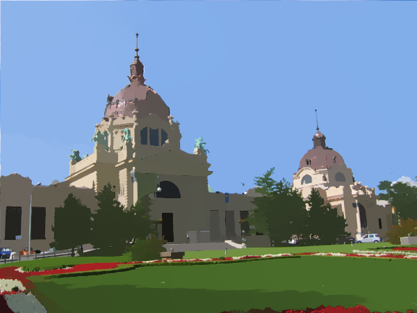
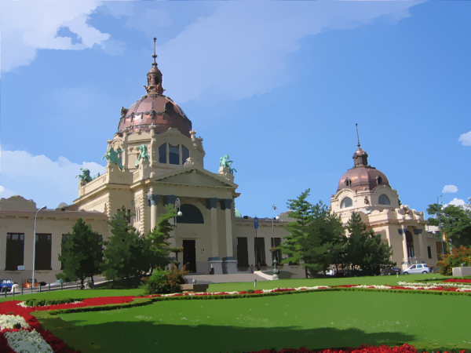
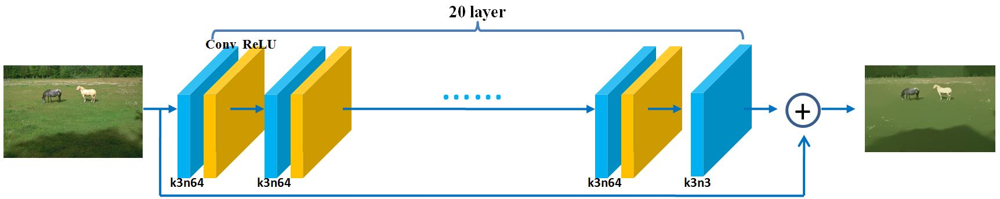
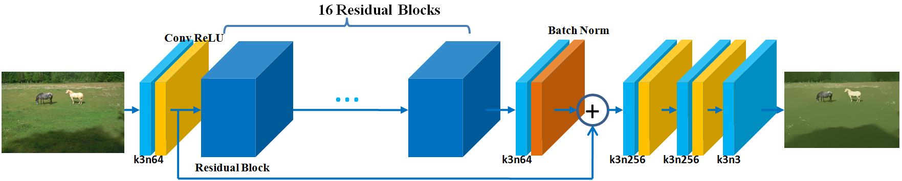
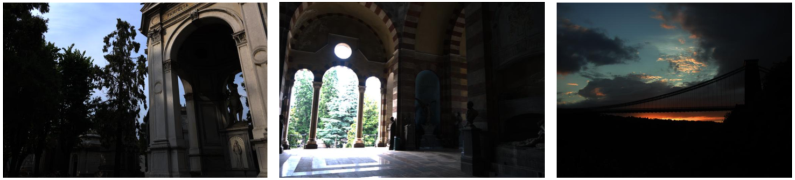
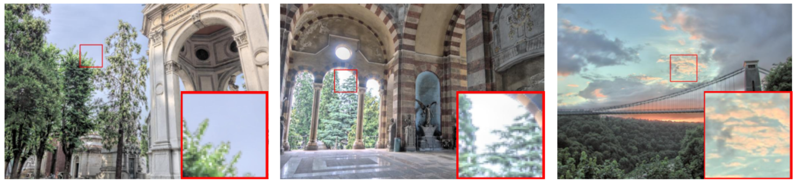
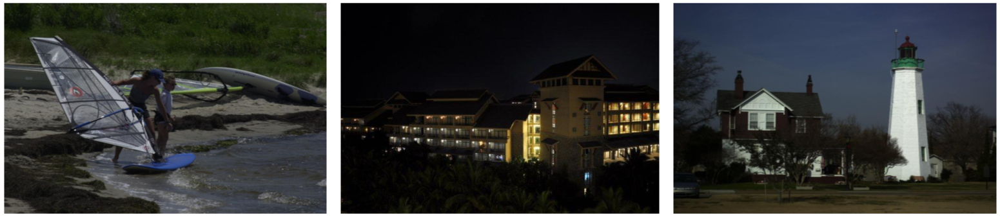
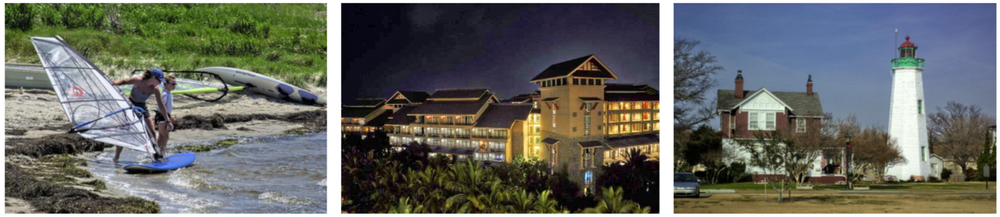

# A Benchmark for  Edge-Preserving Image Smoothing. 

## 1 Introduction

This benchmark includes an image dataset with groundtruth image smoothing results as well as baseline algorithms that can generate competitive edge-preserving smoothing results for a wide range of image contents. The established dataset contains 500 training and testing images with a number of representative visual object categories, while the baseline methods in our benchmark are built upon representative deep convolutional network architectures, on top of which we design novel loss functions well suited for edge-preserving image smoothing. The trained deep networks run faster than most state-of-the-art smoothing algorithms with leading smoothing results both qualitatively and quantitatively.

Dataset can be downloaded at here in [[Google Drive](https://drive.google.com/file/d/1xK6p4qtbu8Hdd-Bxu6jwp6BLYFRa-Lsj/view?usp=sharing)]

Previous state-of-the-art methods code and sample smoothing results can be downloaded at here in [[Google Drive](https://drive.google.com/file/d/1j2IP3Q3CUel21H_JaO9SCfppHyJ4Nmet/view?usp=sharing)]

Please download these two zip files and unzip them to the work directory. The complete file structure should be like this.
```bash
.
├── Previous_Methods
│   ├── Previous_Methods_Code
│   ├── method_1_sdf
│   ├── method_2_l0
│   ├── method_3_fgs
│   ├── method_4_treefilter
│   ├── method_5_wmf
│   ├── method_6_l1
│   └── method_7_llf
├── dataset
│   ├── compute_WMAE_WRMSE.py
│   ├── gt_images
│   ├── origin_images
│   └── weight_matrix.mat
├── Resnet_tl
├── VDCNN_tf
├── README.md
```

## 2 Dataset Usage

original image sample:
<p align='center'>
 
</p>

groundtruth image sample:
<p align='center'>
  
   
  
  
  
</p>

- **original images:** The constructed dataset for edge-preserving smoothing contains 500 natural images named by ```0001-0500.png``` (```0001-0400.png``` for training and ```0401-0500.png``` for testing). The original images are located at ```dataset/origin_images```. 
- **ground truth images:** Each image is associated with 14 human-selected smoothing results. We only keep the five most chosen results. The "ground truth" images are located at ```dataset/gt_images``` and the weight for each gt image is save at ```dataset/weight_matrix.mat```. For example, the ground truth images of ```0001.png``` are named by ```0001_1.png--0001_5.png```.

We proposed two quantitative measures: Weighted Mean Absolute Error (**WMAE**) and Weighted Root Mean Squared Error (**WRMSE**). Run ```dataset/compute_WAME_WRMSE.py``` to evaluate your own algorithm performance.

```shell
cd dataset
python compute_WMAE_WRMSE.py --result_path=path_to_your_result_folder
```


## 3 Baseline Methods: VDCNN and ResNet

<p align='center'>
 
</p>

<p align='center'>
 
</p>

### Disclaimer:

- Our code is based on Tensorflow v1.12 in Python 3.6.
- Our code has been tested on Ubuntu 16.04 and Mac.
- CPU is supported. But GPU is preferred for training.

### Usage:
* **VDCNN: very deep convolutional neural network.** A pretrained model "model-140002" is provided in the checkpoint folder. The test results will be saved at result_VDCNN
```shell
cd VDCNN_tf
python main_vdsr_ReguTerm.py
python test.py
```
* **ResNet: residual block based netwrok.** A pretrained model "model-345002" is provided in the checkpoint folder. The test results will be saved at result_ResNet
```shell
cd Resnet_tl
python main_resnet_delta.py
python test_delta.py
```

You can set your own training hyperparameters by providing addtional arguments, such as 
- iteration number ```--iteration_num```
- training batch size ```--batch_size```
- cropped patch size ```--patch_size```
- stride between training patch ```--stride```

### Citation
If you find this benchmark helpful for your research, please consider citing:
```
To be added
```

## 4 Previous Methods

We have selected some state-of-the-art methods including:
* **SD filter:** B. Ham, M. Cho, and J. Ponce, “Robust guided image filtering using nonconvex potentials," TPAMI 2017 [[paper](https://hal.archives-ouvertes.fr/hal-01279857/file/sdfilter_revised_v2.pdf)]

* **L0 smoothing:** L. Xu, C. Lu, Y. Xu, and J. Jia, “Image smoothing via l0 gradient minimization,” TOG 2011. [[paper](http://www.academia.edu/download/11538018/l0smooth_siggraph_asia2011.pdf)]

* **Fast Global Smoothing (FGS):** D. Min, S. Choi, J. Lu, B. Ham, K. Sohn, and M. N. Do, “Fast global image smoothing based on weighted least squares,” TIP 2014 [[paper](https://www.researchgate.net/profile/Dongbo_Min/publication/267871655_Fast_Global_Image_Smoothing_Based_on_Weighted_Least_Squares/links/55ad977108ae98e661a4327f/Fast-Global-Image-Smoothing-Based-on-Weighted-Least-Squares.pdf)]

* **Tree Filtering:** L. Bao, Y. Song, Q. Yang, H. Yuan, and G. Wang, “Tree filtering: Efficient structure-preserving smoothing with a minimum spanning tree,” TIP 2014 [[paper](https://57a5352b-a-62cb3a1a-s-sites.googlegroups.com/site/linchaobao/home/tip13treefilter.pdf?attachauth=ANoY7cqwETCNki6K4wadbDb6RqnQQxzLqhg3-DerA67l7um7GfILHinE2eFrf5dYHhGVT8HPhjRG9BHUpCqM33V0ioSnQ7vWKDQSqxJJxE67c-5vIR_8hctchznT9kZdaUFaZ4tFVNDNK87QpwV11-UGjlueBmBXlSlIVvB_D8pVXx-4IVjVZ7nK9IhYO0qQDAoLoA-XLGWYhn4BY_PocwUv4imLXhwy_IjLM6Ww0qJy_92HZ9Rz4vk%3D&attredirects=0)]

* **Weighted Median Filter (WMF):** Q. Zhang, L. Xu, and J. Jia, “100+ times faster weighted median filter (wmf),” CVPR 2014 [[paper](http://openaccess.thecvf.com/content_cvpr_2014/papers/Zhang_100_Times_Faster_2014_CVPR_paper.pdf)]

* **L1 smoothing:** S. Bi, X. Han, and Y. Yu, “An l1 image transform for edge-preserving smoothing and scene-level intrinsic decomposition,” TOG 2015 [[paper](https://hub.hku.hk/bitstream/10722/215521/1/Content.pdf?accept=1)]

* **Local Laplacian Filter (LLF):** S. Paris, S. W. Hasinoff, and J. Kautz, “Local laplacian filters: Edge- aware image processing with a laplacian pyramid.” siggraph 2011 [[paper](http://people.csail.mit.edu/hasinoff/pubs/ParisEtAl11-lapfilters-lowres.pdf)]

### Demo
Check ```Previous_Methods/Previous_Methods_Code/test_parameter.m``` for the usage of these methods. All are written in **Matlab** code.

```matlab
im_smooth = sdfilter(g,u0,f,nei,param.sdfilter.lambda,mu,nu,step,issparse);
im_smooth = L0Smoothing(im,param.l0.lambda,param.l0.kappa);
im_smooth = FGS(im,param.fgs.sigma,param.fgs.lambda);
im_smooth = TreeFilterRGB_Uint8(im,param.treefilter.sigma,param.treefilter.sigma_s);
im_smooth = jointWMF(im,im,param.wmf.r,param.wmf.sigma);
im_smooth = l1flattening(im, l1_param);
im_smooth = lapfilter(im,param.llf.sigma_r,param.llf.alpha,1,'rgb','lin');
```

### Evaluate Performance
Take SD filter as an example. The folder ```Previous_Methods/method_1_sdf``` has contained smoothed results with one specific parameter setting. You can evaluate the performance of SD filter with that parameter setting on our benchmark by running 
```shell
cd dataset
python compute_WMAE_WRMSE.py --result_path=../Previous_Methods/method_1_sdf/parameters_2
```

## 5 Application

Smoothing high-contrast details while preserving edges is a useful step in many applications. We briefly discuss two applications, including tone mapping and contrast enhancement, by applying the trained ResNet model as the edge-preserving smoothing filter. Please refer to paper for more details

* **Tone Mapping**
<p align='center'>
 
</p>
<p align='center'>
 
</p>

* **Contrast Enhancement**
<p align='center'>
 
</p>
<p align='center'>
 
</p>


## Acknowledgements
This work was partially supported by Hong Kong Research Grants Council under General Research Funds (HKU17209714 and PolyU152124/15E). 

We also would like to thank Lida Li, Jin Xiao, Xindong Zhang, Hui Li, Jianrui Cai, Sijia Cai, Hui Zeng, Hongyi Zheng, Wangmeng Xiang, Shuai Li, Runjie Tan, Nana Fan, Kai Zhang, Shuhang Gu, Jun Xu, Lingxiao Yang, Anwang Peng, Wuyuan Xie, Wei Zhang, Weifeng Ge, Kan Wu, Haofeng Li, Chaowei Fang, Bingchen Gong, Sibei Yang and Xiangru Lin for constructing the dataset.


